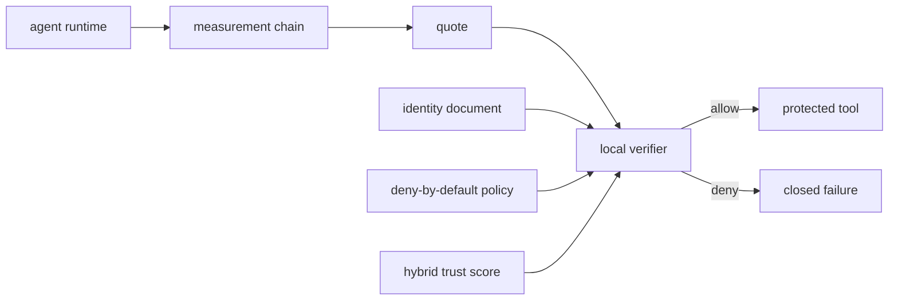

<p align="center"></p>

# On-Device Agent Runtime Attestation

[](https://github.com/on-device-agent-runtime-attestation/on-device-agent-runtime-attestation/actions/workflows/ci.yml)
[](https://github.com/on-device-agent-runtime-attestation/on-device-agent-runtime-attestation/actions/workflows/formal.yml)
[](https://github.com/on-device-agent-runtime-attestation/on-device-agent-runtime-attestation/actions/workflows/security.yml)
[](https://github.com/on-device-agent-runtime-attestation/on-device-agent-runtime-attestation/actions/workflows/codeql.yml)

On-Device Agent Runtime Attestation is a Python reference implementation of runtime measurement, quote freshness, replay rejection, local verification, policy enforcement, and trust scoring for tool-using on-device agents.

The paper describes hardware-backed roots of trust, including a Trusted Platform Module (TPM) or Trusted Execution Environment (TEE). Those roots are not available on ordinary hosted runners. This repository therefore exposes a pluggable attestation backend interface and ships a software reference backend. The software backend is useful for tests and reproducible experiments, but it is not a hardware security boundary.

## How it works



The verifier accepts a tool call only when identity, quote nonce, quote freshness, replay state, measurements, policy, trust, and secret checks all pass. Any failed check denies by default.

## Quickstart

```powershell
py -3.12 -m venv .venv
.\.venv\Scripts\python -m pip install -e ".[dev]"
.\.venv\Scripts\python -m pytest -q
.\.venv\Scripts\on-device-agent-runtime-attestation demo
```

## Implemented paper components

| Paper component | Repository implementation |
|---|---|
| Runtime measurement chain | `MeasurementChain` stores ordered file measurements and a tamper-evident digest. |
| Quote and nonce freshness | `AttestationQuote` binds measurements to nonce, timestamp, sequence, and backend name. |
| Local verifier | `LocalVerifier` enforces identity, attestation, policy, trust, replay, and leak checks. |
| Key hierarchy | `SoftwareReferenceBackend` signs quotes with a process-local key and documents that it is not hardware-backed. |
| Hardware root interface | `AttestationBackend` protocol plus `TrustedPlatformModuleToolBackend` validation adapter. |
| Trust scoring | Wilson lower bound, Beta-Binomial cold start, exponentially weighted behavior, Dirichlet per-tool reputation, and combined score. |
| Failure policy | Every invalid or missing component denies by default. |
| Benchmark traces | A vendored copy of Zero Trust Agent Benchmark dataset version 4.1 with pinned hashes. |
| Formal claim | A Temporal Logic of Actions Plus model checks stale quote and replay rejection invariants. |

See `docs/hypotheses.md`, `docs/threat-model.md`, and `docs/reproducibility.md` for honest reproduction notes.
