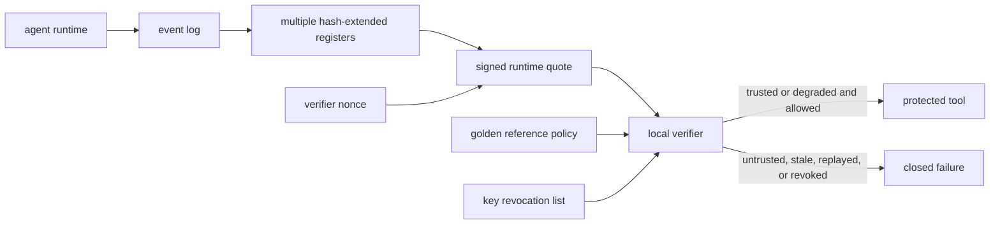

<p align="center"></p>

# On-Device Agent Runtime Attestation

[](https://github.com/on-device-agent-runtime-attestation/on-device-agent-runtime-attestation/actions/workflows/ci.yml)
[](https://github.com/on-device-agent-runtime-attestation/on-device-agent-runtime-attestation/actions/workflows/formal.yml)
[](https://github.com/on-device-agent-runtime-attestation/on-device-agent-runtime-attestation/actions/workflows/security.yml)
[](https://github.com/on-device-agent-runtime-attestation/on-device-agent-runtime-attestation/actions/workflows/codeql.yml)

On-Device Agent Runtime Attestation is a Python reference implementation of a fully offline local attestation protocol for tool-using agents. It measures the runtime, signs quotes over Platform Configuration Register style hash-extended registers, verifies freshness and replay state locally, appraises measurements against golden references, and gates tool execution.

The paper describes hardware-backed roots of trust, including a Trusted Platform Module (TPM) and Trusted Execution Environment (TEE). Hosted continuous integration runners do not provide those roots. This repository therefore exposes a pluggable backend interface, ships an honestly labelled software reference backend, and includes a manual software Trusted Platform Module workflow for deployments that want to experiment with external tooling. The software backend is reproducible, but it is not a hardware security boundary.

## How it works



The verifier accepts a tool call only when the nonce was issued by the verifier, the quote is inside the freshness window, clock skew is bounded, the event log replays to the quoted registers, the signature key is not revoked, the sequence is not reordered, and the appraisal permits the requested tool.

## Quickstart

```powershell
py -3.12 -m venv .venv
.\.venv\Scripts\python -m pip install -e ".[dev]"
.\.venv\Scripts\python -m pytest -q
.\.venv\Scripts\on-device-agent-runtime-attestation demo
```

## Implemented paper components

| Paper component | Repository implementation |
|---|---|
| Multiple runtime measurements | `MeasurementLog` extends independent registers and stores a replayable event log. |
| Quote and nonce freshness | `RuntimeQuote` binds nonce, timestamp, sequence, event log hash, and registers. |
| Local verifier | `LocalVerifier` rejects stale, replayed, reordered, unsigned, revoked, and non-replayable quotes. |
| Key hierarchy | `KeyHierarchy` derives software attestation keys from a local root and supports rotation and revocation. |
| Hardware root interface | `AttestationBackend` protocol plus software reference and manual software Trusted Platform Module workflow. |
| Golden reference appraisal | `AppraisalPolicy` returns trusted, degraded, or untrusted outcomes that gate tools. |
| Failure policy | Every invalid or missing component denies by default. |
| Benchmark traces | The repository does not vendor traces. It installs the benchmark package in continuous integration, reads sibling traces locally, and asserts dataset version `zero-trust-agent-benchmark-dataset-v4.1` plus test split SHA-256 `d065bab9bed145490579cd7add6a574c6e23c21c0ea4525dc1c14b0fc15acd2b`. |
| Formal claim | A Temporal Logic of Actions Plus model checks stale quote, replay, reorder, invalid event log, and appraisal monotonicity invariants. |

## Measured results

The corrected benchmark crosses every trace step with each runtime condition: clean, tampered runtime, tampered tool manifest, tampered policy, stale or replayed quote, and rolled-back measurement. The benchmark label is used only for scoring. This fixes a prior circular methodology in which malicious labels selected tampering.

On the unmodified benchmark test split, the final clean-runtime policy blocked 102 of 500 attack steps: 20.4%, Wilson 95% interval [17.1%, 24.2%]. Clean-runtime false positives were 0 of 1500 benign steps: 0.0%, Wilson 95% interval [0.0%, 0.26%]. Under every tampered runtime condition, benign and attack steps were blocked or degraded 100.0%; blocking benign calls under compromise is reported as availability cost, not as a clean false positive. Final 95th-percentile policy latency over 100 trials was 0.583 ms. The chunked model artifact verifier measured 471 MiB/s on a 4 GiB synthetic artifact, far from a 120 ms full-hash claim.

See `docs/hypotheses.md`, `docs/threat-model.md`, and `docs/reproducibility.md` for reproduction details, corrected ablations, and known non-reproductions.
